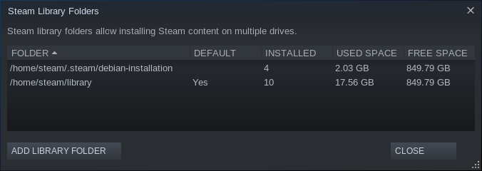

# Containerize Steam with systemd-nspawn

- Published on August 16 of 2021
- Updated on August 31 of 2021
- [Markdown][raw]
- [Simplified Chinese][zhs]

[raw]: https://raw.githubusercontent.com/liolok/liolok.com/master/containerize-steam-with-systemd-nspawn/index.md
[zhs]: https://liolok.com/zhs/containerize-steam-with-systemd-nspawn/

---

- [Create Btrfs Subvolume](#create-btrfs-subvolume)
- [Install Minimal Ubuntu](#install-minimal-ubuntu)
- [Network](#network)
- [Locale](#locale)
- [Install Steam](#install-steam)
- [Other Preparation](#other-preparation)
- [Passthrough Devices](#passthrough-devices)
  - [Graphic Cards](#graphic-cards)
  - [Joysticks](#joysticks)
- [Wrap Up](#wrap-up)
- [Game Issues](#game-issues)
  - [Don't Starve Together](#dont-starve-together)
    - [No Sound](#no-sound)
  - [Plants vs. Zombies GOTY Edition](#plants-vs-zombies-goty-edition)
    - [FPS Drop During Plant Selection](#fps-drop-during-plant-selection)
  - [Beholder](#beholder)
    - [Blank CJK Fonts](#blank-cjk-fonts)

---

## Create Btrfs Subvolume

```console
# su # switch to root user
# cd /var/lib/machines
# container_name=steam
# btrfs subvolume create $container_name
```

Then it will be easy to [snapshot][snapshot] and [migrate][migrate] the container.

[snapshot]: https://wiki.archlinux.org/title/Btrfs#Snapshots
[migrate]: https://wiki.archlinux.org/title/Btrfs#Send/receive

## Install Minimal Ubuntu

> Reference: [systemd-nspawn - ArchWiki](https://wiki.archlinux.org/title/Systemd-nspawn#Create_a_Debian_or_Ubuntu_environment)

Codename of current latest LTS version of Ubuntu is `focal`.
Feel free to use your preferred repository.

```console
# codename=focal
# repository_url='https://mirrors.ustc.edu.cn/ubuntu/'
# debootstrap --include=systemd-container \
--components=main,universe,multiverse \
$codename $container_name $repository_url
```

After installation, run `systemd-nspawn --machine=$container_name` to boot into brand new container.

## Network

You may need to add `--bind-ro=/etc/resolv.conf` option to make DNS work in container.

To check network status, consider commands `ping 1.1.1.1` and `ping archlinux.org`: if former works and latter doesn't, it would be DNS problem.

## Locale

> Reference: [Generating locales - ArchWiki](https://wiki.archlinux.org/title/Locale#Generating_locales)

Without `en_US.UTF-8` locale, steam will complain some errors.

## Install Steam

Inside container, [enable i386 architecture][multiarch] and install the [package][package] from Ubuntu official repository:

[multiarch]: https://wiki.debian.org/Multiarch/Implementation#Using_multiarch
[package]: https://packages.ubuntu.com/focal/steam

```console
# dpkg --add-architecture i386
# apt-get update
# apt-get install steam
```

According to [file list][filelist], its startup script is located at `/usr/games/steam`. Let's create a symbol link to make it convenient to launch:

[filelist]: https://packages.ubuntu.com/focal/i386/steam/filelist

```console
# file /usr/games/steam
# ln --verbose --symbolic /usr/games/steam /usr/local/bin/
```

Inside container, add a dedicated normal user named "steam" and create user base directories:

```console
# useradd --create-home steam
# su --login steam --shell /bin/bash
# mkdir --parents ~/.config ~/.local/share
```

Later I also created `~/library` to customize Steam default library folder location,
and mounted a folder `~/screenshots` to store screenshots on host.

## Other Preparation

- Display: [Xorg][xorg]
- System tray: [DBus][dbus]
- Audio: [PulseAudio][pulseaudio]
- Cursor: [icon theme][styles]

Command options become just too many, from this step we need start to
actually write up a shell script to run Steam in GUI.

[xorg]: https://liolok.com/run-desktop-app-with-systemd-nspawn-container/#xorg
[dbus]: https://liolok.com/run-desktop-app-with-systemd-nspawn-container/#dbus-tray
[pulseaudio]: https://liolok.com/run-desktop-app-with-systemd-nspawn-container/#pulseaudio
[styles]: https://liolok.com/run-desktop-app-with-systemd-nspawn-container/#styles

## Passthrough Devices

### Graphic Cards

- Device files:
  - For Intel or AMD: `--bind=/dev/dri/card0` and so on
  - For NVIDIA: `--bind=/dev/nvidia0` and so on
- Access: `--property=DeviceAllow='char-drm rw'`

### Joysticks

- Device files: `--bind-ro=/dev/input/js0` and so on
- Access: `--property=DeviceAllow='char-input r'`

## Wrap Up

- [fish-shell script][script]: my `systemd-nspawn` wrap-up
- [desktop entry][desktop-entry]

[script]: https://github.com/liolok/dotfiles/blob/master/.local/bin/steam
[desktop-entry]: https://github.com/liolok/dotfiles/blob/master/.local/share/applications/steam.desktop

## Game Issues

### Don't Starve Together

#### No Sound

This game uses [FMOD engine][fmod] and seems to *[explicitly depend on ALSA][alsa]*.
It doesn't play any audio and constantly resets volumes to 0.

[alsa]: https://wiki.archlinux.org/title/Steam/Troubleshooting#Configure_PulseAudio
[fmod]: https://wiki.archlinux.org/title/Steam/Troubleshooting#FMOD_sound_engine

Solutions:
- Debian/Ubuntu: `apt-get install pulseaudio`
- Arch Linux: `pacman --sync pulseaudio-alsa --assume-installed pulseaudio`

<!-- #### CJK Font Messed Up -->

### Plants vs. Zombies GOTY Edition

(Run through Steam Play)

#### FPS Drop During Plant Selection

> Source: [AngrySpaceElf@ProtonDB](https://www.protondb.com/app/3590#l7L1gAH52v)

Replace DRM version executable (5.1MiB) with non-DRM version (3.4MiB).

I uploaded my non-DRM version executable [here](pvz-non-drm.tar.xz) along with its SHA-256 checksum:
`cdddfb30f50510afa389de4966089a1ac1a9a2bf09fb8d0aa0793178b0814cd1`

Here's complete steps to extract non-DRM version executable and replace then:

1. Fresh installation;
2. Startup game (for the very first time) and **do not exit**;
3. Change to corresponding library folder, like mine: `cd /home/steam/library`;
4. Copy `steamapps/compatdata/3590/pfx/drive_c/ProgramData/PopCap Games/PlantsVsZombies/popcapgame1.exe` to `/tmp/`;
5. Exit game;
6. Copy `/tmp/popcapgame1.exe` to overwrite `steamapps/common/Plants\ Vs\ Zombies/PlantsVsZombies.exe`, done.

Where is library folder? Go to "Settings->Downloads->Content Libraries" to open library folders configuration dialog:



### Beholder

#### Blank CJK Fonts

> Source: [求助，游戏打开后没有字 :: Beholder General Discussions](https://steamcommunity.com/app/475550/discussions/0/2592234299563997618/?ctp=2#c1480982971155734475)

This game exactly depends on font "WenQuanYi Micro Hei", on Ubuntu 20.04 its package is `fonts-wqy-microhei`:

```console
# systemd-nspawn --machine=steam --bind-ro=/etc/resolv.conf apt install fonts-wqy-microhei
```

If not working, you may need a manually refresh of `fontconfig`:

```console
# systemd-nspawn --machine=steam fc-cache --force --verbose
```
