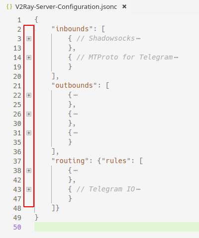

# Run SS and MTProxy Server on AWS

## Meta Info

- Published at Mar 23 of 2019
- [Source code][source]
- [Web page][page] and [zh-Hans version][page_zhs]

[source]: https://raw.githubusercontent.com/liolok/liolok.com/master/run-ss-and-mtproxy-server-on-aws/index.md
[page]: https://liolok.com/run-ss-and-mtproxy-server-on-aws
[page_zhs]: https://liolok.com/zhs/run-ss-and-mtproxy-server-on-aws

## Signup an AWS account

A credit card is needed for signup the account, see support types below.


https://portal.aws.amazon.com/billing/signup

*AWS accounts include 12 months of free tier access,
including use of Amazon EC2, Amazon S3, and Amazon DynamoDB.*

We will create an [Arch Linux][0] EC2 instance in this article,
and setup a [V2Ray][1] service to run server for Shadowsocks and MTProxy.

[0]: https://www.archlinux.org/
[1]: https://www.v2ray.com/en/index.html "Project V · Project V"

(It's not only Amazon that provides one-year free VPS,
but also Google. Maybe I'll cover on that later.)

## Create EC2 Instance

### Choose Image

Visit [this link][2] (from [ArchWiki][3]) and choose an image by region.


[2]: https://www.uplinklabs.net/projects/arch-linux-on-ec2/
[3]: https://wiki.archlinux.org/index.php/Arch_Linux_AMIs_for_Amazon_Web_Services "Arch Linux AMIs for Amazon Web Services - ArchWiki"

For example if you want an instance in Singapore, so be the `ap-southeast-1` or `ap-southeast-2`.
Click on the "ami-xxxx" link and go on.

### Choose Instance Type


There would be only one free type so we actually have no choice, just skip to step 6.

### Add Traffic Rule


(Well, I don't know how unsafe would it be if we allow all traffic from anywhere.
If you care about security, read the documentations and make it secure.)

### Download Key File and Launch Instance


This `ArchVPS.pem` private key file is quite important, we download it to `~/.ssh/ArchVPS.pem`,
or anywhere considered as safe and not easy to be cleared.

### Connect to Instance

We can see the instance here after launched:


Now we've got the IP address of the instance, run this command to connect:

(Windows users might need [PuTTY][4] or similar tool.)

```console
$ ssh -i ~/.ssh/ArchVPS.pem root@put.instance.ip.here
```

[4]: https://www.putty.org/ "Download PuTTY - a free SSH and telnet client for Windows"

If you get the warning below, run `chmod 400 ~/.ssh/ArchVPS.pem` and retry.

```console
@@@@@@@@@@@@@@@@@@@@@@@@@@@@@@@@@@@@@@@@@@@@@@@@@@@@@@@@@@@
@         WARNING: UNPROTECTED PRIVATE KEY FILE!          @
@@@@@@@@@@@@@@@@@@@@@@@@@@@@@@@@@@@@@@@@@@@@@@@@@@@@@@@@@@@
Permissions 0644 for '.ssh/ArchVPS.pem' are too open.
It is required that your private key files are NOT accessible by others.
This private key will be ignored.
Load key ".ssh/ArchVPS.pem": bad permissions
root@*.*.*.*: Permission denied (publickey).
```

If you get this, just say yes to let SSH know the host.

```console
The authenticity of host '*.*.*.* (*.*.*.*)' can't be established.
ECDSA key fingerprint is SHA256:blablabla.
Are you sure you want to continue connecting (yes/no)? yes
Warning: Permanently added '*.*.*.*' (ECDSA) to the list of known hosts.
```

Now you should have already logged into the instance as root, run `pacman -Syyu`
and then reboot to make sure this Arch Linux is up to date.

## Install V2Ray for SS and MTProxy

### Configuration

First of all, here comes a [configuration template](./v2ray-server-configuration.jsonc "V2ray server configuration file").

Do NOT read it online, download or just copy and paste it to your favorite editor.
For example in VS Code, switch to "JSON with Comments" language mode,
and use folding to understand the hierarchy better.



These are what you need to know about in the `inbounds` part of template,
which would also be used in client configuration:

- Shadowsocks
    - port
    - settings
        - method
        - **password**
- MTProxy for Telegram
    - port
    - settings -> users -> **secret**

You could leave all the other values unchanged, except these two,
you have to complete them on your own:

- Write/generate a password for Shadowsocks, a password more than 16 characters is recommended;
- Generate a user secret for MTProxy, run `openssl rand -hex 16` locally, or on Arch VPS.

Now you've got a complete and unique configuration.
Connect to the instance, run these commands to change configuration to your own.

```console
# pacman --sync v2ray # install V2Ray
# cd /etc/v2ray # change to V2Ray configuration directory
# mv --verbose config.json config.json.origin # backup origin configuration
# nano config.json # edit fresh new configuration
```

In nano editor, paste your own configuration by right-click menu or whatever,
`Ctrl + O` and `Enter` to save, `Ctrl + X` to exit.

### Service

```console
# systemctl enable v2ray.service
# systemctl start v2ray.service
```

Now the service should be running, to check status run `systemctl status v2ray.service`.
