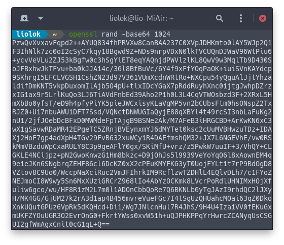
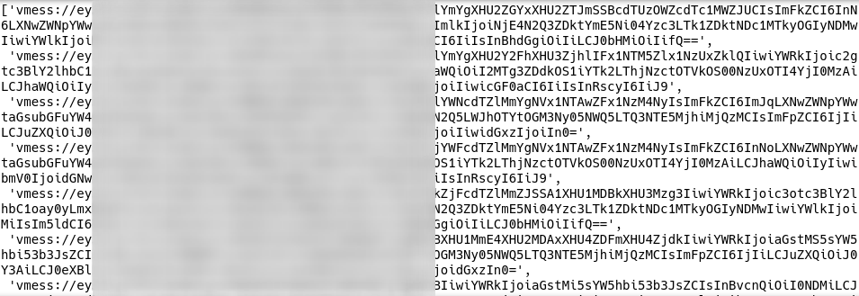

# V2Ray Subscription Parse

## Meta Info

- Published at Nov 18 of 2019
- [Source code][source]
- [Web page][page] and [zh-Hans version][page_zhs]

[source]: https://github.com/liolok/liolok.com/blob/master/v2ray-subscription-parse/index.md
[page]: https://liolok.com/v2ray-subscription-parse/
[page_zhs]: https://liolok.com/zhs/v2ray-subscription-parse/

## Preface

V2Ray core doesn't provide subscription feature, this is cool because it's considered unnecessary to people who self-host just one or several V2Ray services. If using service bought from websites, however, one may have to find a client with subscribe support to get a better user experience.

Up to now, there are several subscription formats; I'm gonna explore to resolve some of them on my own demand, using Python or even other languages.

## V2RayN Format

*[Source documentation][v2rayn-format]*

- Subscription url: a regular url (http / https);
- Return content of subscription url: a list of [share link][v2rayn-share-link], separated by newline, at last encoded using `Base64`;
- Support schemes: `vmess`, `ss` and `socks`.

[v2rayn-format]: https://github.com/2dust/v2rayN/wiki/订阅功能说明 "订阅功能说明 · 2dust/v2rayN Wiki"
[v2rayn-share-link]: https://github.com/2dust/v2rayN/wiki/分享链接格式说明(ver-2) "分享链接格式说明(ver 2) · 2dust/v2rayN Wiki"

Example:

```
vmess://base64(Configuration)
ss://base64(Configuration)
socks://base64(Configuration)
```

### Get Content from Subscription Url

*[HOWTO Fetch Internet Resources Using The urllib Package — Python 3.8.0 documentation](https://docs.python.org/3/howto/urllib2.html#fetching-urls "HOWTO Fetch Internet Resources Using The urllib Package — Python 3.8.0 documentation")*

```py
from urllib.request import urlopen
subscribe_url = 'https://input-your-own-v2rayn-format-subscribe-url-here'
return_content = urlopen(subscribe_url).read()
print(return_content)
```

Now we should get a really long string that seems random, like this:



### Get Share Links

*[base64 — Base16, Base32, Base64, Base85 Data Encodings — Python 3.8.0 documentation](https://docs.python.org/3/library/base64.html?highlight=base64#base64.b64decode "base64 — Base16, Base32, Base64, Base85 Data Encodings — Python 3.8.0 documentation")*

```py
from base64 import b64decode
share_links = b64decode(return_content).decode('utf-8').splitlines()
print(share_links)
```

This step we get a list of share link string:



### Get Configurations

- *[urllib.parse — Parse URLs into components — Python 3.8.0 documentation](https://docs.python.org/3/library/urllib.parse.html#urllib.parse.urlsplit "urllib.parse — Parse URLs into components — Python 3.8.0 documentation")*
- *[json — JSON encoder and decoder — Python 3.8.0 documentation](https://docs.python.org/3/library/json.html#json.loads "json — JSON encoder and decoder — Python 3.8.0 documentation")*

```py
from urllib.parse import urlsplit
import json
schemes_allow = ['vmess', 'ss', 'socks']
configs = []
for share_link in share_links:
    url = urlsplit(share_link)
    if url.scheme not in schemes_allow: raise RuntimeError('invalid share link')
    configs.append(json.loads(b64decode(url.netloc).decode('utf-8')))
print(configs)
```

> Note: You may have to [add padding][padding] to `url.netloc`.

[padding]: https://github.com/liolok/blog-hexo/issues/36#issuecomment-646955535

Finally we get a list of json objects, each of them contains a server configuraion:


