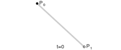
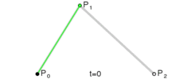
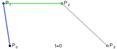
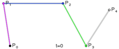
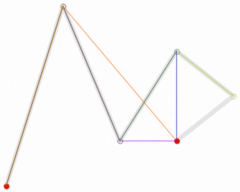

# Bézier 曲线与 De Casteljau 算法

- 发布于 2018 年 4 月 28 日
- [Markdown][raw]

[raw]: https://raw.githubusercontent.com/liolok/liolok.com/master/zhs/bezier-curve-and-de-casteljau-algorithm/index.md

当年还在用 Windows XP 的时候，就有一个屏保叫「贝塞尔曲线」，我们今天就来看一看它的基本原理以及简单绘制。

## Bézier 曲线

一条 $$n$$ 次 Bézier 曲线可以表示为：$$R(t)=\sum_{i=0}^n R_iB_{i,n}(t),\quad 0\leq t\leq 1$$，其中：

- $$R_i$$ 是控制顶点，我们可以看出，一条 $$n$$ 次 Bézier 曲线有 $$n+1$$ 个控制顶点，即 $$n$$ 次 $$n+1$$ 阶曲线；
- $$B_{i,n}(t)$$ 是 Bernstein 基函数，定义为：$$B_{i,n}(t)=C_n^i(1-t)^{n-i}t^i$$，其中 $$C_n^i$$ 为二项式系数
$$C_n^i=\frac{n!}{i!(n-i)!}$$。

两点特性：

- 从几何意义上看，当参数 $$t=0$$ 时，对应的是曲线的第 $$0$$ 个控制顶点; 而当参数 $$t=1$$ 时，
对应的是曲线的第 $$n$$ 个控制顶点。这就是 Bézier 曲线的端点插值特性，即 $$R(0)=R_0$$，$$R(1)=R_n$$；
- 由于二项式系数的对称特性 $$C_n^i=C_n^{n-i}$$， Bézier 曲线控制顶点的也具有几何地位上的对称性，即
$$\sum_iR_iB_{i,n}(t)=\sum_iR_{n-i}B_{i,n}(t)$$。

Bézier 曲线还有其他的性质，这里就不展开讨论了。下面重点讲一下如何求 Bézier 曲线的任意点。

## 按曲线定义求值

按照定义公式求 Bézier 曲线上参数 $$t$$ 对应点的过程，就是对这 $$n+1$$ 个控制顶点各分量（比如二维时即横纵坐标分量）经由
Bernstein 基函数进行混合后累加，最终得到参数 $$t$$ 对应点坐标。

从上一节里我们可以看出，在用定义求值的过程中，涉及到的运算有阶乘和乘幂。当曲线次数很低时，这看起来是很简单的，但当曲线次数上升，数值稳定性就炸了。对应的一套代码我也写了一遍，就不贴上来丢人了，光是一个乘幂函数就经不起数值稳定性考验。

## De Casteljau 算法求值

[De Casteljau 算法](https://en.wikipedia.org/wiki/De_Casteljau's_algorithm "De Casteljau's algorithm - Wikipedia")
是在实际应用中对 Bézier 曲线进行求值以及逼近绘制等操作所使用的算法。相比前面的定义求值法，它更加快速且稳定，更贴近 Bézier 曲线特性。

De Casteljau 算法的核心内容是*线性插值（Linear interpolation）*。那什么是线性插值呢?

### 线性 Bézier 曲线

两点一线，控制多边形恰好是一条线段，即是最简单的线性曲线。



此时原始公式特化为：$$R(t)=(1-t)R_0+tR_1$$

**这——就是线性插值。**

### 二次 Bézier 曲线

三点两线，控制多边形有两条线段，便是二次曲线。



此时我们需要 **3** 次线性插值才能得到 $$R(t)$$ :

$$R_0^{(1)}=(1-t)R_0+tR_1$$

$$R_1^{(1)}=(1-t)R_1+tR_2$$

$$R(t)=R_0^{(2)}=(1-t)R_0^{(1)}+tR_1^{(1)}$$

其中 $$R_0^{(1)}​$$ 是上图中左边的绿点，$$R_1^{(1)}​$$ 则是右边的绿点。

### 更高次的情况

我这里只继续搬运一些动画，感受一下如何逐渐推广。

三次曲线：


四次曲线：


五次曲线：


> 以上动画取自：[Bézier curve - Wikipedia](https://en.wikipedia.org/wiki/Bézier_curve "Bézier curve - Wikipedia")。

### 推广

从最开始的线性一次曲线，到二次，再到更高次，我们发现：只要对控制多边形上的各个线段当成线性曲线进行线性插值，就会得到更少的点和线段，只要重复进行线性插值，无论多少次的曲线，最终都会出现三次，二次，最终得到一个线性曲线。此时再进行最后一次线性插值，我们就得到了想要的点。

这个线性插值的重复过程我参考了很多资料后觉得还是用下图中的金字塔模型来描述最形象，自下而上，最后得到塔顶即是所求的点。


以下代码仅为 deCasteljau 算法求值的示例代码，头文件的具体实现取决于该函数的需求:

```cpp
#include "Point.h" // 二维坐标点
#include "Bezier.h" // Bezier 曲线
#include <assert.h>
Point deCasteljauEval(const Bezier& R, double t)
{
    assert(R.getOrder()); // 确保曲线存在（阶数大于零）
    int n = R.getOrder() - 1; // 曲线次数 n
    Point ** P = new Point*[n + 1]; // 为金字塔申请 n+1 层
    for (int i = 0; i <= n; i++) // 为每一层金字塔申请内存
    {
        P[i] = new Point[n - i + 1]; // 第 0 层长度为 n+1 并逐层递减至 1
        P[0][i] = R[i]; // 第 0 层填入曲线 R 的 n+1 个控制顶点
    }
    for (int s = 1; s <= n; s++) // 遍历第 1~n 层金字塔
        for (int i = 0; i <= n - s; i++) // 第 s 层长度为 n-s+1
        {
            // 第 s 层第 i 点由下层的第 i 跟 i+1 点线性插值得出
            P[s][i] = (1 - t) * P[s - 1][i] + (t)* P[s - 1][i + 1];
        }
    Point Rt = P[n][0]; // 得到金字塔顶的点，即曲线上参数 t 对应的点 R(t)
    for (int i = 0; i <= n; i++) delete[]P[i]; delete[]P; // 释放内存
    return Rt;
}
```

### 剖分示例


## 参考资料

[The de Casteljau Algorithm for Evaluating Bezier Curves](the-de-casteljau-algorithm-for-evaluating-bezier-curves.pdf)：这篇论文给了我很大启发，包括但不限于前面提到的金字塔模型。
