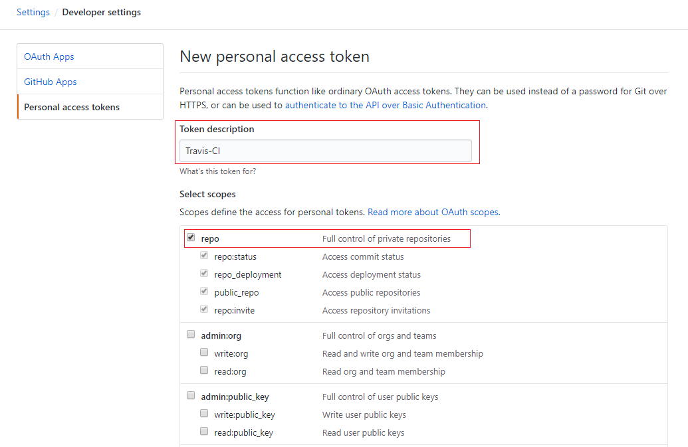
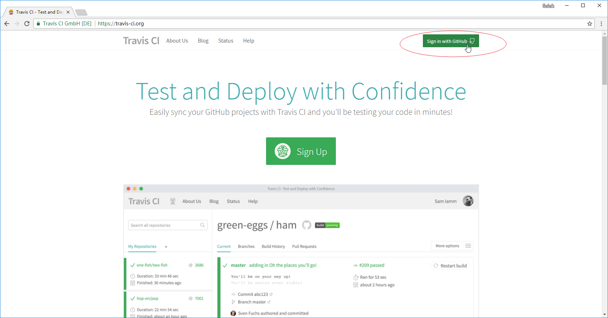
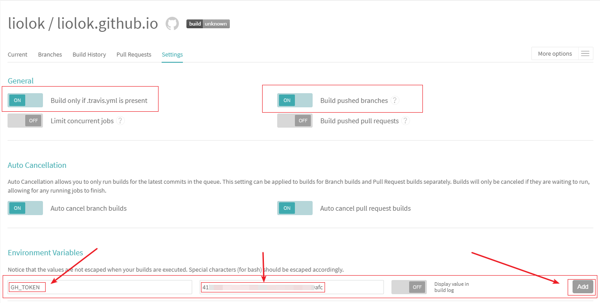

# 使用 Travis CI 部署 Hexo 博客

## 关于本文

- 最初发布于 2018 年 5 月 25 日
- 最后更新于 2018 年 5 月 26 日
- [源码][source]
- [网页][page]

[source]: https://github.com/liolok/liolok.com/blob/master/zhs/deploy-hexo-blog-with-travis-ci/index.md
[page]: https://liolok.com/zhs/deploy-hexo-blog-with-travis-ci

本人后来转用 GitHub Actions 或者 GitLab CI，本文仅留作参考。

## 博客的部署流程

### 最初的基本流程

[博客搭建](https://liolok.com/zhs/build-blog-with-hexo-and-github-pages)一文中写过从本地部署到云端，这两者分别对应着什么呢？

- 本地的博客实例，里面有我们用 Markdown 写的文章、有文章引用的资源比如图片、还有博客以及主题的各种配置文件。我觉得这些可以叫做「博客源码」。
- 云端的 GitHub 代码仓库（repository），以 *username*.github.io 命名，默认分支 master 里面是托管给 GitHub Pages 的静态网站文件。我觉得可以叫做「博客站点」。

按照之前的流程，我们在本地目录创建一个基于 Hexo 框架的博客实例，然后进行配置与写作，本地预览调试觉得没问题可以上线博客了，再将博客生成静态网站文件并部署到 GitHub 的仓库上。不出意外的话，很快就能看到网站已经可以访问了。


上图中的部署（deploy）其实就是 Hexo 封装好的 `git push`，将生成好的静态文件目录 `./public` 推送（push）到配置好的仓库相应的分支上，参见前文中的[部署配置](https://liolok.com/zhs/build-blog-with-hexo-and-github-pages#部署配置)一节。

用了半个月发现这个流程确实有问题，这就涉及到Git的本质：**版本控制**。通过每次提交（commit）及其附加的消息（message），我们可以看到博客的变迁过程，也可以在出了错误的时候吃一吃后悔药，这些都是版本控制的效果。

我想那肯定要好好利用啊，正好学习学习 Git 以及 GitHub 的基本操作。结果我更迷茫了：

每次对博客做了改动，小心翼翼地 `hexo deploy --generate --message "update something"`（`hexo d -g -m "update something"`），然后在仓库的历史提交记录里查看时，却发现根本看不到自己对于博客**配置或者文章**的改动，出现在眼前的是经由 Hexo 框架和 NexT 主题渲染生成的 HTML 和 CSS 这些**静态文件**。我就一个博客框架用户，也看不懂啊。这就好比我写了 C 的代码，提交上去之后想看看代码变化，却发现全是汇编甚至机器码。这不是我想要的「**版本控制**」。

### 目前的较新流程

生成的静态站点文件什么的，就照旧放在仓库的 master 分支好了，GitHub Pages 会帮你把后面的事情做好。而我们进行版本控制的对象，不应该是 master 分支里的静态站点，而是博客源码，这里面才是实际的博客配置和文章，我们关心的是这些。

那么如何实现呢？我参考了很多博文和讨论、看完了八仙过海之后，我个人的做法是：
把博客源码推送到仓库的新建分支 source，并使用 Travis CI 将 source 分支里的博客源码自动部署到 master 分支。这样一来，重心放在博客本身上，后面的生成静态文件和部署，交给 Travis CI 去做，我们只看结果，没毛病就不问过程，想看过程也有日志可以看）。


## 博客实例的版本控制

### 创建 source 分支

```bash
# 克隆项目到本地目录
git clone https://github.com/用户名/用户名.github.io.git
# 进入项目
cd 用户名.github.io/
# 创建并切换到 source 分支
git checkout --branch source
```

保留目录下的 .git 文件夹，删除其他文件，将之前已创建好的博客实例迁移至 `用户名.github.io` 目录下，继续后面的步骤。

### 添加 Git 忽略列表

创建 `.gitignore` 文件：
```
node_modules/
public/
db.json
```

其中：
1. `node_modules` 目录是 Hexo 博客实例的环境依赖，据说是质量比黑洞还大的物体（笑）。我们选择忽略它，反正最后到了 Travis 那里也会重新跑一遍 `npm install`，这些东西本来也会删了重来，没有同步的意义；
2. `public` 目录是生成的静态文件，`db.json` 是数据库文件，同理，由于 Travis 构建流程中会执行 `hexo clean`，也都不需要同步。

### 配置主题子模块

关于博客实例根目录下 themes 目录中的主题有两种做法：

1. 将主题打包下载并解压到对应子目录下；
2. 使用 `git clone` 将主题拉取到对应子目录下。

如选择第一种方式，则不需要配置 git 的子模块。如需更新主题，可以定期打包下载新版本并手动解决冲突，使用新的特性同时保留自定义的配置。

我还是选择更 git 一点，使用子模块功能实现主题甚至主题插件的添加及更新。

#### fork 主题项目

比如我选择使用 NexT 主题，就需要先去其项目主页 [theme-next/hexo-theme-next](https://github.com/next-theme/hexo-theme-next) 进行 fork，得到一个 [liolok/hexo-theme-next](https://github.com/liolok/hexo-theme-next)。这样一来，就可以针对个人需求定制主题的同时，通过 git 更新主题。

#### 添加子模块

创建/修改 `.gitmodules` 文件

```
[submodule "themes/next"]
    path = themes/next
    url = https://github.com/liolok/hexo-theme-next
```

此处的 URL 协议使用 HTTPS 对于 CI 来说是方便的；但是对于本地使用场景来讲，推送到主题的远程仓库会需要 GitHub 用户名密码登录验证，更新主题时会比较麻烦。

另一个方案是默认使用 SSH 协议，在 CI 部署前使用脚本自动改为 HTTPS，这样可以兼顾两种场景。详见此处的[讨论][discussion]以及 akkuman 的 [`.travis.yml#L22-L23`][script]。

[discussion]: https://github.com/liolok/blog-hexo/issues/4#issuecomment-419354125
[script]: https://github.com/akkuman/akkuman.github.io/blob/0d4e74927842d42838fbff752ffd681be952c638/.travis.yml#L22-L23

#### 设置上游项目

```bash
cd themes/next/
git remote add upstream https://github.com/next-theme/hexo-theme-next
```

## Travis CI 自动部署

### GitHub 账号的 Personal Access Token

Travis CI 需要的 Token 才能有相应的权限替我们自动完成特定的操作。

进入账号的设置（settings），左侧菜单最下方的 Developer settings 选项，继续选择 Personal access tokens，通过右上方的 Generate new token 生成一个 Travis CI 自动部署博客专用的 Token。



如上图所示，填写 Token 用途后，选中 repo 权限即可，通过下方（权限列表略长，往下翻页即可）的 Generate token 按钮完成生成，并及时复制 Token，妥善保管。


### Travis CI 线上配置

#### 使用GitHub账号登入


#### 开启仓库的自动构建并进入详细设置


#### 详细设置及添加 Token


因为仓库下有两个分支：master 以及 source，开启上图中的「Build only if .travis.yml is present」选项，保证不包含 `.travis.yml` 配置文件的 master 分支不会被监测变动以致循环构建。

### 构建流程配置

博客实例根目录下我所使用的 `.travis.yml` 配置：

```yaml
language: node_js # 设置语言

node_js: stable # 设置相应的版本

branches:
  only:
    - source # 只监测 source 分支变动
env:
 global:
   - GH_REF: github.com/username/username.github.io.git # 设置 GH_REF

cache:
  directories: # 缓存特定目录，加快构建速度
    - node_modules

# 开始构建
before_install:
  - export TZ='Asia/Shanghai' # 统一构建环境和博客配置的时区，防止文章时间错误

install:
  - npm install # 配置 Hexo 环境

script:
  - hexo clean # 清除
  - hexo generate # 生成

after_script:
  - cd ./public
  - git init
  - git config user.name "your-username" # 用户名
  - git config user.email "your-email" # 邮箱
  - git add .
  - git commit --message "Site deployed by Travis CI" # 提交Commit时的说明
  - git push --force --quiet "https://${GH_TOKEN}@${GH_REF}" master:master # GH_TOKEN 是在 Travis CI 中所配置 Token 的名称
# 结束构建
```

- 从上面的配置文件中可以看到，Travis CI 的构建流程中并没有使用 `hexo deploy`/`hexo d` 这一命令，而是在生成静态文件后直接将整个静态文件夹全新推送到 master 分支，这也体现了前文提到的「无需对站点静态文件进行版本控制」。
- 由于不再需要 `hexo deploy` 命令，我们完全可以把博客实例中的 hexo-deployer-git 插件及其相关的部署配置全部精简掉。这样也能确保本地的博客实例不会误操作命令。

## 参考资料

- [知乎：使用 Hexo，如果换了电脑怎么更新博客？](https://www.zhihu.com/question/21193762)参考了大多数回答里的做法，决定采用同仓库下双分支的做法进行博客版本控制，并使用 Travis CI 实现自动部署。

### 子模块相关

- [Hexo 博客源码管理 - 使用Git子模块 - 辛未羊的博客](https://panqiincs.me/2017/08/06/hexo-blog-code-management/#使用git子模块)
- [坑3：Travis CI 自动构建部署之后，博客页面空白，什么也没有 - CodingLife](https://magicse7en.github.io/2016/03/27/travis-ci-auto-deploy-hexo-github/#坑3：-travis-CI自动构建部署之后，博客页面空白，什么也没有)
- ~~[手动配置 Git 的 Submodule - Strago's Corner](https://blog.strago.xin/2016/GitSubmodule/)~~

### Travis CI 相关

- [使用 Travis CI 持续构建 Hexo - neoFelhz's Blog](https://web.archive.org/web/20180904004710/https://blog.nfz.moe/archives/hexo-auto-deploy-with-travis-ci.html)：参考了 Travis 线上配置选项以及开启 source 分支保护
- [使用 Travis CI 自动部署 Hexo 博客 - IT 范儿](https://www.itfanr.cc/2017/08/09/using-travis-ci-automatic-deploy-hexo-blogs/#创建-travis-yml-文件)：参考了其中最简单版本的 `.travis.yml` 配置文件（不考虑对站点文件的版本控制）
